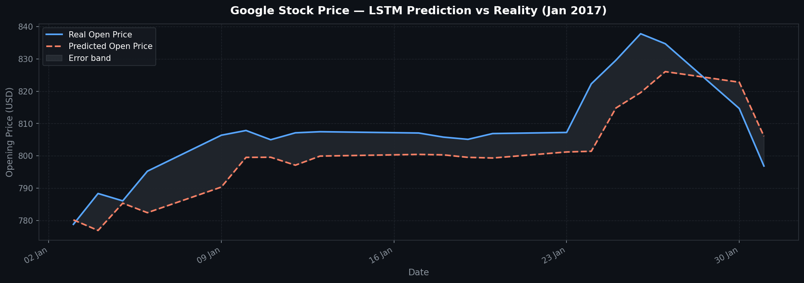
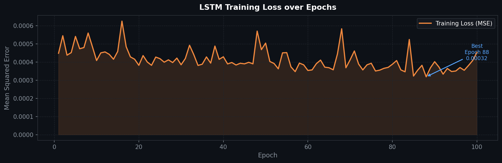
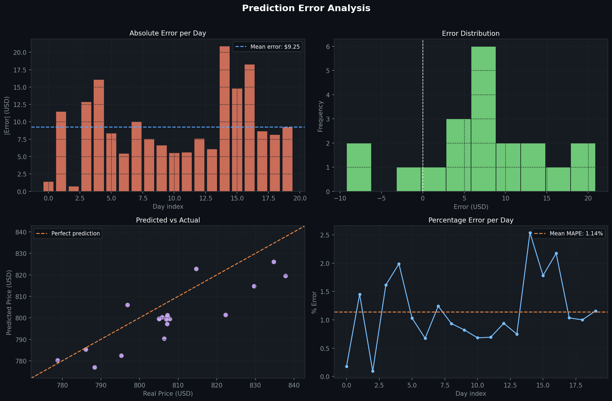
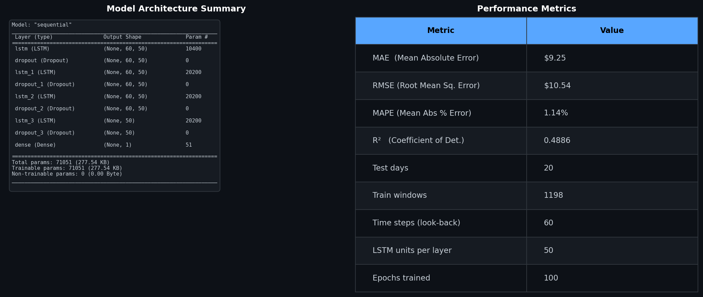

# 📈 Google Stock Price Prediction — Stacked LSTM

> Predicting Google's daily opening stock price with a 4-layer stacked LSTM neural network, trained on 5 years of historical data and evaluated with rich visualisations.

---

## 🧠 Model Architecture

```
Input → LSTM(50) → Dropout(0.2)
      → LSTM(50) → Dropout(0.2)
      → LSTM(50) → Dropout(0.2)
      → LSTM(50) → Dropout(0.2)
      → Dense(1)
```

| Hyperparameter | Value |
|---|---|
| Look-back window | 60 days |
| LSTM units per layer | 50 |
| Dropout rate | 0.2 |
| Optimizer | Adam |
| Loss | Mean Squared Error |
| Batch size | 32 |
| Epochs | 100 |

---

## 📊 Results

| Metric | Value |
|---|---|
| MAE  | $9.25 |
| RMSE | $10.54 |
| MAPE | 1.14% |
| R²   | 0.49 |

### Prediction vs Reality


### Training Loss Curve


### Error Analysis


### Model Summary & Metrics


---

## 🗂 Dataset

| File | Description |
|---|---|
| `Google_Stock_Price_Train.csv` | Jan 2012 – Dec 2016 (1,258 trading days) |
| `Google_Stock_Price_Test.csv`  | Jan 2017 (20 trading days) |

The model uses only the **Open** price column. Prices are scaled to `[0, 1]` with `MinMaxScaler` (fit on training data only).

---

## 🚀 Quick Start

### 1. Clone the repo
```bash
git clone https://github.com/Payamsoltanzadeh/RNN-LSTM.git
cd RNN-LSTM
```

### 2. Install dependencies

**macOS (Apple Silicon — M1/M2/M3/M4/M5):**
```bash
pip install numpy==1.24.3 tensorflow-macos==2.13.0 tensorflow-metal==1.0.1 \
            pandas matplotlib scikit-learn ipykernel
```

**Other platforms:**
```bash
pip install -r requirements.txt
# replace tensorflow-macos with tensorflow if not on Apple Silicon
```

### 3. Run the notebook
Open `notebook.ipynb` in VS Code or Jupyter and run all cells top-to-bottom.

---

## 📁 Project Structure

```
RNN-LSTM/
├── notebook.ipynb                  # Full pipeline: data → model → plots
├── Google_Stock_Price_Train.csv    # Training data (2012–2016)
├── Google_Stock_Price_Test.csv     # Test data (Jan 2017)
├── requirements.txt                # Python dependencies
├── plot_prediction.png             # Figure 1 — Prediction vs Reality
├── plot_loss.png                   # Figure 2 — Training loss curve
├── plot_error_analysis.png         # Figure 3 — 4-panel error analysis
└── plot_summary.png                # Figure 4 — Model summary & metrics
```

---

## 🔧 Environment

Tested on:
- **Apple M5** · macOS Sequoia
- Python 3.9.6
- TensorFlow-macOS 2.13.0 + TensorFlow-Metal 1.0.1 (GPU acceleration)
- NumPy 1.24.3

---

## 📚 Key Concepts

| Concept | Role in this project |
|---|---|
| **LSTM** | Captures long-range dependencies in the price sequence |
| **Dropout** | Regularisation — prevents overfitting to training noise |
| **MinMaxScaler** | Normalises prices to `[0,1]` for stable gradient flow |
| **Many-to-one** | 60 past days → 1 future price |
| **Adam optimizer** | Adaptive learning rate; good default for sequence models |

---

## 📝 License

MIT — free to use, modify, and distribute.
